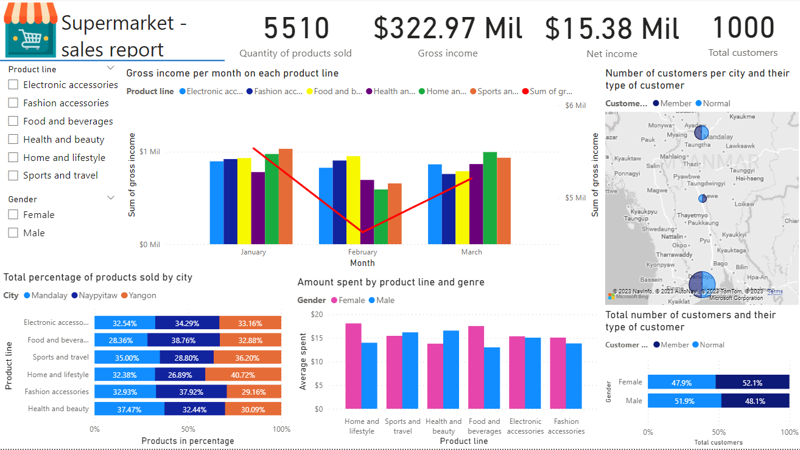

# Supermarket Sales Report 

## Descrição do Projeto
O projeto Supermarket Sales Report é uma aplicação desenvolvida no Power BI para a análise e visualização dos dados de vendas de um supermercado. Através dessa solução, é possível obter insights valiosos sobre o desempenho das vendas, identificar padrões de consumo, acompanhar tendências e tomar decisões informadas com base nos dados.

## Funcionalidades
O Supermarket Sales Report oferece as seguintes funcionalidades:

<ol>
  <li><strong>Dashboard de vendas</strong>: Apresenta um resumo geral das vendas, como receita total, número de itens vendidos, vendas por categoria, vendas por região, entre outros. 
  O dashboard permite uma visão rápida e abrangente do estado atual das vendas.</li>
  
  <li><strong>Análise por período</strong>: Permite ao usuário selecionar um período específico para análise, como um mês. Através dessa funcionalidade, 
  é possível visualizar as vendas de forma detalhada em um período selecionado, comparando o desempenho em diferentes períodos.</li>
  
  <li><strong>Segmentação por região</strong>: Permite segmentar as vendas por região geográfica, facilitando a identificação de áreas com maior ou menor desempenho. 
  Essa análise geográfica pode ajudar na tomada de decisões relacionadas a estratégias de expansão, alocação de recursos e promoções específicas para determinadas regiões.</li>
  
  <li><strong>Análise de categorias de produtos</strong>: Permite visualizar as vendas de acordo com as diferentes categorias de produtos oferecidos pelo supermercado. 
  Essa análise pode auxiliar na identificação de quais categorias têm maior demanda, quais precisam de ajustes ou melhorias e quais podem ser descontinuadas.</li>
  
  <li><strong>Gráficos e visualizações interativas</strong>: O Supermarket Sales Report oferece diversos tipos de gráficos e visualizações interativas para facilitar a compreensão dos dados de vendas. 
  Essas visualizações incluem gráficos de barras, mapas, entre outros. O usuário pode interagir com as visualizações para explorar os dados em diferentes níveis de detalhes.</li>
</ol>
